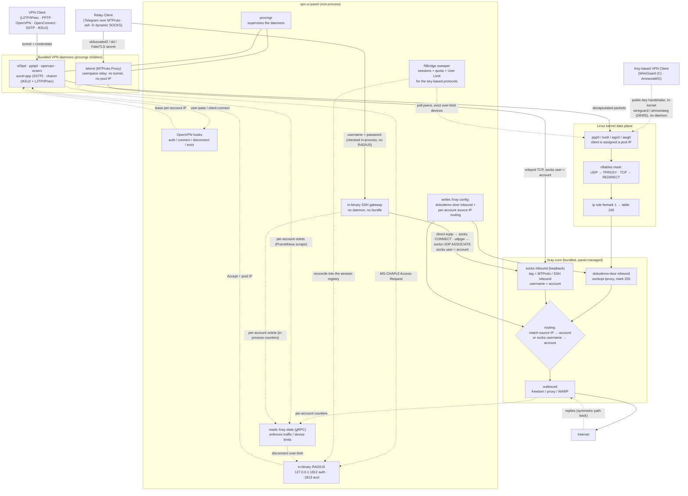

# backendها چطوری با Xray-core کار می‌کنن

backendهای VPN خودشون هیچ traffic‌ای رو route نمی‌کنن. فقط tunnel رو terminate
می‌کنن (توی relayها هم خودِ connection کلاینت رو) و همه‌ی packetهای هر client رو
تحویل **Xray-core** می‌دن. این Xray-core هست که routing، محدودیت‌ها (limit) و خروج
به اینترنت (egress) رو انجام می‌ده. اون پلی که این وسط این دو تا رو به هم وصل
می‌کنه، یه پرش **TPROXY/REDIRECT** توی nftables هست که traffic رو می‌ندازه داخل یه
inbound از نوع **dokodemo-door** که خود panel توی config مربوط به Xray می‌سازتش؛
توی relayها هم به‌جاش یه inbound از نوع **socks** روی loopback همین کار رو می‌کنه.

این ۱۱ تا پروتکل از سه تا مسیر مختلف به همین data plane می‌رسن:

- **tunnelهای daemon‌دار** (بچه‌های procmgr): یعنی PPTP، L2TP (RAW)، L2TP/IPsec،
  OpenVPN، OpenConnect، SSTP و IKEv2. اینجا `pptpd`، `xl2tpd`، `openvpn`،
  `ocserv`، `accel-ppp` (برای SSTP) و `charon` (برای IKEv2 و اون سمت IPsec مربوط
  به L2TP/IPsec) به‌عنوان child process خود panel اجرا می‌شن و یه interface مثل
  `ppp0`/`tun0` با یه IP از pool بالا میارن.
- **داخل kernel و بدون daemon**: یعنی WireGuard (C) روی ماژول `wireguard` که خود
  kernel داره، و AmneziaWG روی ماژول out-of-tree به اسم `amneziawg` که panel با
  **DKMS** روی خود سرور می‌سازتش. اینجا panel مستقیم peerها رو ست می‌کنه و kernel
  هم `wgc0`/`awg0` رو بالا میاره. هر دوشون با public key احراز هویت می‌شن، برای
  همین **RBridge** اون چیزایی رو که معمولاً RADIUS می‌داد (یعنی session و
  حساب‌وکتاب مصرف و User Limit) براشون فراهم می‌کنه.
- **relayهای userspace** (نه tunnel دارن نه IP از pool): یعنی MTProto Proxy
  (همون `telemt`) و SSH (یه gateway که داخل خود binary نوشته شده). اینا
  connection کلاینت رو terminate می‌کنن و دوباره می‌فرستنش داخل اون inbound از نوع
  **socks** روی loopback، که username اون socks همون account‌ه؛ پس routing به‌جای
  source IP از روی username انجام می‌شه.

## مرحله به مرحله

۱. **اتصال و authentication**. این یکی بستگی داره به اینکه پروتکل از کدوم دسته
   باشه. tunnelهای daemon‌دار وصل می‌شن به daemon متناظر خودشون (که همه‌شون رو
   `procmgr` پنل supervise می‌کنه): احراز هویت L2TP و PPTP و SSTP و OpenConnect و
   همین‌طور IKEv2 توی حالت `eap-mschapv2` از طریق **RADIUS** داخلیِ خود binary
   انجام می‌شه (دیتاش توی SQLite و key گذاریش روی Calling-Station-Id)، ولی
   OpenVPN از طریق hook خودش یعنی `openvpn-auth` احراز هویت می‌شه. اما
   WireGuard (C) و AmneziaWG اصلاً چنین رفت‌وبرگشتی ندارن و کل handshake رو با
   public key داخل kernel انجام می‌دن، بدون هیچ daemonی؛ حالت‌های `psk` و
   `eap-tls` مربوط به IKEv2 هم همین‌طورن. relayها هم هرکدوم ساز خودشون رو می‌زنن:
   MTProto با secret خود proxy و SSH با username و password که همون داخل خود
   process چک می‌شه.

۲. **اختصاص IP**. به محض اینکه accept شد، به اون account یه **source IP** از pool
   مربوط به همون inbound داده می‌شه (اگه User Limit با K روشن باشه، یه بلاک از
   IPهای پشت‌سرهم می‌گیره) و بعدش interface کاربر یعنی `ppp0`/`tun0` با همون IP
   بالا میاد. توی WireGuard (C) و AmneziaWG ماجرا فرق داره: panel به‌ازای هر جای
   دستگاه، یه config و یه جفت‌کلید و یه IP جدا روی `wgc0`/`awg0` می‌ده. relayها هم
   کلاً استثنان و هیچ IPی از pool نمی‌گیرن، چون اصلاً tunnelی در کار نیست که
   بخواد IP داشته باشه.

۳. **هدایت traffic به داخل Xray**. برای هرچیزی که interface خودش رو داره،
   nftables روی همون interface جلوی traffic کاربر رو می‌گیره: **UDP از طریق
   TPROXY و TCP از طریق REDIRECT** (این جدا کردن به‌خاطر اینه که باگ
   IP_TRANSPARENT روی IPv6 رو دور بزنیم). packetها mark می‌خورن تا با
   `ip rule fwmark 1 → table 100` هدایت بشن به inbound از نوع **dokodemo-door**
   داخل Xray. relayها کلاً این پرش رو رد می‌کنن و مستقیم با inbound از نوع
   **socks** روی loopback حرف می‌زنن.

۴. **routing بر اساس کاربر**. هر VPN inbound یه dokodemo-door جفت‌شده داره که
   panel می‌سازتش و می‌ذاره توی config مربوط به Xray. حالا Xray از روی **source
   IP** همون packet تشخیص می‌ده مال کدوم account‌ه، rule خودش رو اعمال می‌کنه و
   می‌فرستتش سمت outbound (که می‌تونه freedom، یه proxy یا WARP باشه). توی relayها
   هم دقیقاً همین تصمیم گرفته می‌شه، منتها از روی **username** همون socks که
   account توش هست.

۵. **خروج به اینترنت و برگشت**. outbound می‌فرسته سمت اینترنت؛ جواب‌ها هم دقیقاً
   از همون مسیر برعکس برمی‌گردن: Xray، بعدش daemon یا همون interface داخل kernel،
   و آخرش client.

۶. **حساب‌وکتاب traffic و limitها**. panel هر چند وقت یه‌بار stats مربوط به Xray
   رو از طریق **gRPC** می‌خونه تا مصرف هر account رو ببینه؛ هر وقت quota، انقضا
   (expiry) یا محدودیت تعداد device پر بشه، کاربر رو قطع می‌کنه (از طریق RADIUS یا
   همون hookها). مصرف MTProto از روی scrape مربوط به Prometheus روی `telemt`
   حساب می‌شه و مصرف SSH هم از روی شمارنده‌های داخل خود process، چون هیچ‌کدوم
   traffic‌شون روی یه interface نیست که بشه شمردش.

۷. **RBridge، برای پروتکل‌های مبتنی بر کلید**. WireGuard (C) و AmneziaWG و
   حالت‌های `psk` و `eap-tls` مربوط به IKEv2 هیچ رفت‌وبرگشتی با RADIUS ندارن، پس
   خودبه‌خود نه session‌ای براشون ثبت می‌شد، نه حساب‌وکتاب مصرفی، نه User Limitی.
   برای همین **RBridge** هر بار توی traffic tick، peerها و SAهای زنده‌شون رو
   می‌خونه، quota و disable و همون **User Limit** با K رو اعمال می‌کنه (اضافی‌ها
   رو evict می‌کنه) و بعد بقیه رو می‌ریزه توی همون session registry مربوط به
   RADIUS و همون حساب‌وکتاب nftables که پروتکل‌های RADIUSی از قبل ازش استفاده
   می‌کردن.
