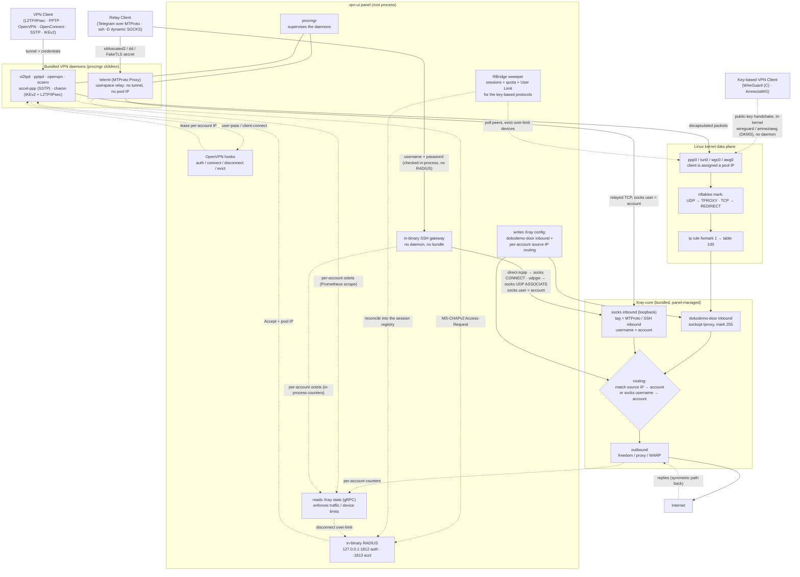

# How the VPN backends interact with Xray-core

The VPN backends don't route traffic themselves. They only **terminate the
tunnel** (or, for the relays, the client's connection) and hand every client's
packets to **Xray-core**, which does the per-account routing, limits and egress.
The bridge is an nftables **TPROXY/REDIRECT** hop into a **dokodemo-door**
inbound that the panel writes into the Xray config; the relays use a loopback
**socks** inbound instead.

The eleven protocols reach that same data plane by three different routes:

- **Daemon-backed tunnels** (procmgr children): PPTP, L2TP (RAW), L2TP/IPsec,
  OpenVPN, OpenConnect, SSTP and IKEv2. `pptpd`, `xl2tpd`, `openvpn`, `ocserv`,
  `accel-ppp` (SSTP) and `charon` (IKEv2 plus the IPsec leg of L2TP/IPsec) run as
  panel child processes and bring up a `ppp0`/`tun0` interface holding a pool IP.
- **In-kernel, no daemon**: WireGuard (C) on the in-tree `wireguard` module, and
  AmneziaWG on the out-of-tree `amneziawg` module that the panel builds on the
  host with **DKMS**. The panel programs the peers directly and the kernel brings
  up `wgc0`/`awg0`. Both authenticate by public key, so **RBridge** supplies the
  session record, traffic accounting and User Limit that RADIUS would otherwise
  provide.
- **Userspace relays** (no tunnel, no pool IP): MTProto Proxy (`telemt`) and SSH
  (a gateway written into the binary itself). They terminate the client's
  connection and re-emit it into Xray's loopback **socks** inbound with the
  account as the socks username, so routing keys on that username rather than on
  a source IP.

## Walkthrough

1. **Connect & authenticate.** How this happens depends on the protocol class.
   The daemon-backed tunnels dial in to their matching bundled daemon (all
   supervised by the panel's `procmgr`): L2TP, PPTP, SSTP, OpenConnect and IKEv2
   in its `eap-mschapv2` mode authenticate through the **in-binary RADIUS**
   server (SQLite-backed, keyed by Calling-Station-Id), while OpenVPN goes
   through the panel's `openvpn-auth` hook. WireGuard (C) and AmneziaWG do a
   public-key handshake in the kernel with no daemon and no round-trip at all,
   as do the IKEv2 `psk` and `eap-tls` modes. The relays authenticate on their
   own terms: MTProto on the proxy secret, SSH on a username and password
   checked in-process.
2. **Address assignment.** On accept, the account gets a **source IP** from the
   inbound's pool (a block of consecutive IPs for multi-device *User Limit* K),
   and the client's `ppp0`/`tun0` interface comes up with that IP. For
   WireGuard (C) and AmneziaWG the panel instead hands out one config, one
   keypair and one `wgc0`/`awg0` tunnel IP per device slot. The relays are the
   exception: they never allocate a pool IP, because there is no tunnel to
   number.
3. **Redirect into Xray.** For everything that owns an interface, nftables
   intercepts the client's traffic there: **UDP via TPROXY, TCP via REDIRECT**
   (the split avoids the IP_TRANSPARENT-on-IPv6 bug), marking packets so
   `ip rule fwmark 1 → table 100` steers them into Xray's **dokodemo-door**
   inbound. The relays skip this hop entirely and speak to Xray's loopback
   **socks** inbound directly.
4. **Route by user.** Each VPN inbound has a paired dokodemo-door inbound that
   the panel injects into the Xray config. Xray **matches the packet's source IP
   to the account** and applies its rule, then picks an outbound (freedom, a
   proxy, or WARP). For the relays the same decision is made from the **socks
   username**, which carries the account.
5. **Egress & return.** The outbound sends to the internet; replies return
   symmetrically back through Xray, then the daemon or the kernel interface, and
   finally the client.
6. **Accounting & limits.** The panel polls Xray's **stats API over gRPC** for
   per-account usage; when a quota, expiry or device limit is hit it disconnects
   the client (via RADIUS or the OpenVPN hooks). MTProto is metered from a
   Prometheus scrape of `telemt` and SSH from in-process counters, since neither
   has traffic on an interface to count.
7. **RBridge, for the key-based protocols.** WireGuard (C), AmneziaWG and the
   IKEv2 `psk` / `eap-tls` modes never make a RADIUS round-trip, so on their own
   they would have no session record, no accounting and no User Limit. Once per
   traffic tick the **RBridge** sweeper polls their live peers and SAs, enforces
   quota, disable and the per-account **User Limit** K (evicting the losers),
   then reconciles the survivors into the very same RADIUS session registry and
   nftables accounting the RADIUS protocols already use.
